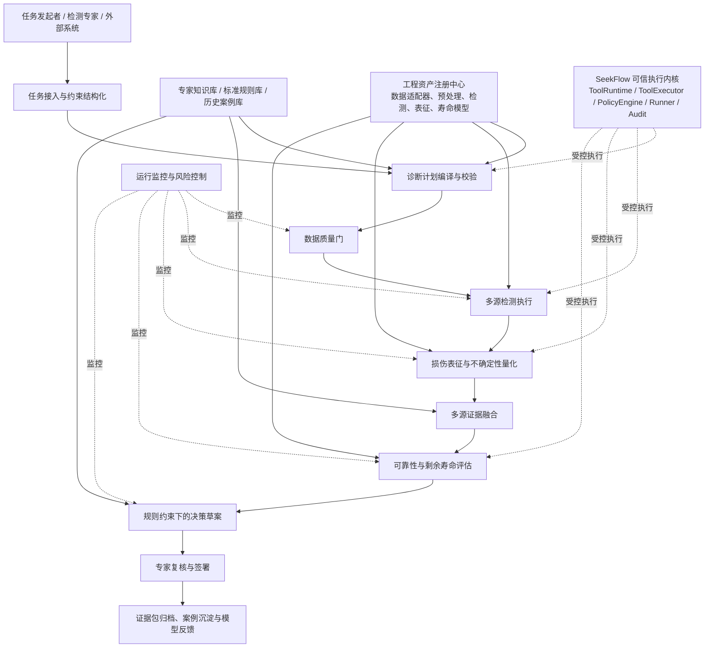
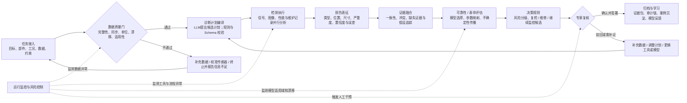
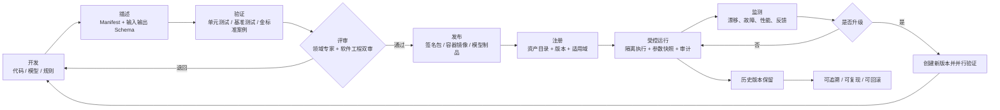

# 面向航空发动机损伤诊断的可扩展智能体系统工程指导文档

> 基于 SeekFlow 的领域化改造、插件规范、证据链与实施路线
>
> **适用对象：**系统架构师、算法开发人员、可靠性工程师、检测专家、软件测试人员与项目负责人  
> **文档版本：**V1.2（纯文本架构 Markdown 版）  
> **日期：**2026年7月17日

> **架构图说明：**本文所有架构图均已转换为内嵌 Mermaid 源码，不依赖图片或 `media/` 目录。即使代码 Agent 不具备多模态能力，也可以直接读取节点、连线、分层关系和回退路径；在支持 Mermaid 的 Markdown 阅读器中还可自动渲染为图形。



**文本化主链：**任务接入 → 计划编译 → 数据质量门 → 检测执行 → 损伤表征 → 证据融合 → 可靠性/寿命评估 → 决策草案 → 专家复核 → 归档与持续改进。

# 0. 系统建设目标与用户需求

## 0.1 系统建设总目标

本项目拟在现有 SeekFlow 智能体框架基础上，建设一套面向航空发动机损伤检测、诊断、表征、可靠性评估和寿命分析的**可扩展、可验证、可审计、可持续演进的工程智能体平台**。

该系统不是只完成某一种损伤识别或某一个固定算法流程，而是要形成一个长期可积累的工程基础平台：能够接入多种来源和类型的数据，按任务自动规划分析路径，受控调用不同的数据处理工具、检测算法、损伤表征工具、可靠性与寿命模型，并结合专家知识与历史案例形成有证据支撑的分析结果和候选处置建议。

系统最终应实现以下目标：

1. **统一接入多源数据。** 支持振动、声学、温度、压力、转速、EGT、性能参数、孔探图像与视频、维护记录、载荷谱、材料参数、有限元结果和历史案例等输入。
2. **形成完整诊断闭环。** 完成“任务理解—数据质量检查—检测规划—算法执行—损伤表征—可靠性/寿命评估—证据融合—决策草案—专家复核—结果归档”的全过程。
3. **沉淀可复用工程资产。** 将已有和未来新增的数据处理程序、检测算法、表征算法、可靠性模型、寿命模型、知识条目、规则和案例统一注册、管理和调用。
4. **支持持续扩展与改进。** 新增算法、模型、数据格式或知识库时，不需要修改主工作流和 Agent 核心代码，只需按照统一协议完成插件注册、验证和发布。
5. **保证工程可信性。** 每一个结果均能够追溯到原始数据、算法或模型版本、输入参数、运行环境、知识依据、规则条款和审核人员。
6. **控制高可靠场景风险。** Agent 负责辅助理解、规划、编排和解释，确定性算法负责计算，规则引擎负责约束，最终安全关键结论由授权专家确认。
7. **具备自主监控能力。** 持续监测数据质量、算法运行、模型适用域、资源状态、流程异常、结果冲突和安全事件，并在权限范围内执行阻断、重试、降级或请求人工干预。

## 0.2 用户提出的核心要求

本指导文档围绕以下明确要求进行设计：

| 用户要求 | 本文档中的落实方式 |
|---|---|
| 深度结合现有系统代码，而不是脱离 SeekFlow 另起炉灶 | 明确保留 `ToolRuntime`、`ToolExecutor`、`PolicyEngine`、Runner、StateGraph、Checkpoint 和审计能力，并给出逐类改造清单 |
| 收集并接入多种数据处理工具、检测算法、损伤表征工具、可靠性与寿命模型 | 建立统一 `EngineeringAsset` 协议、资产分类、Manifest、注册中心、执行代理和验证流程 |
| 接入专家知识和历史案例库 | 单独设计 `KnowledgeService`、规则库、案例库、知识条目规范、来源引用和案例相似度边界 |
| 支持多种输入数据 | 建立 `Artifact`、时序数据、图像数据、文本记录、载荷材料数据等统一领域对象和数据适配器规范 |
| 给出清晰的系统框架和具体实现方式 | 提供分层架构、控制面与执行面、服务划分、状态机、API、存储、部署和开发目录 |
| 给出明确、稳定的拓展接口 | 定义数据适配器、算法插件、模型插件、知识源、案例源、监控插件以及统一输入输出 Schema |
| 系统可以不断拓展与改进 | 建立版本管理、资产状态机、准入验证、回滚、兼容性、金标准案例和反馈闭环 |
| 避免大量算法直接暴露给大模型 | 采用“少量稳定平台工具 + 后台工程资产注册中心”的两级调用架构 |
| 支持 Multi-Agent 协作 | 将规划、数据质量、检测、表征、寿命、决策和监控定义为受约束职责角色，并由冻结工作流调度 |
| 保证结果可靠、可复现、可追踪 | 强制记录数据哈希、资产版本、参数快照、随机种子、环境镜像、证据关系和专家签名 |
| 适用于航空发动机高可靠工程场景 | 设置适用域检查、OOD 检查、不确定性传播、强制审批、风险分级和安全失败机制 |
| 支持未来本地化和保密部署 | 设计容器 Runner、GPU Worker、远程/本地模型适配、数据分级、网络白名单和离线部署形态 |

## 0.3 本文档需要解决的核心工程问题

本文档重点回答以下问题：

- SeekFlow 中哪些模块应当保留，哪些模块必须领域化扩展？
- 多种算法和模型应当如何封装，才能长期增加而不破坏主系统？
- 多源数据、算法结果、损伤参数和寿命结果之间应当采用什么统一数据协议？
- Agent 如何选择工具和模型，同时避免自由调用、错误外推和不可复现？
- 专家知识、标准条款、经验规则和历史案例应当如何管理和引用？
- 如何构建完整证据链、不确定性传播、人机复核和自主监控机制？
- 如何从现有代码逐步实施，而不是一次性重写整个系统？


# 文档定位与结论先行

> **核心结论：**现有 SeekFlow 适合作为“可信执行与 Agent 调度内核”，但不能直接等同于航空发动机损伤诊断平台。建议保持 SeekFlow 核心相对稳定，在其上新增独立的领域扩展包与服务层，构建工程资产注册、结构化数据、证据链、不确定性、模型验证、规则决策和专家复核能力。

- PPT提出的“任务输入—规划—检测—表征—可靠性/寿命—决策—人机复核”主链是正确的，但应实现为受约束状态机，而不是多个Agent自由对话。

- 所有算法、模型和知识不应直接以大量工具暴露给大模型。大模型只使用少量稳定的“平台级工具”，由工具代理和资产注册中心在后台选择具体版本。

- 所有阶段必须交换结构化对象，不以自然语言作为唯一接口。自然语言只用于解释、摘要和与专家交互。

- 最终结论必须由确定性算法、规则、标准条款和专家签署共同形成；LLM 不得独立给出安全关键放行结论。

- 扩展能力的关键不是多写几个@tool，而是建立统一Manifest、输入输出Schema、适用域、验证状态、版本、资源需求、误差与不确定性、审计和回滚规范。

# 目录

0. 系统建设目标与用户需求

1. 需求理解与系统边界

2. 现有 SeekFlow 代码能力评估

3. 总体设计原则

4. 目标系统分层架构

5. 受约束的Multi-Agent任务闭环

6. 统一领域数据与证据对象

7. 工程资产与插件扩展规范

8. 数据接入与预处理体系

9. 检测、表征、可靠性与寿命模型接入

10. 专家知识库与案例库

11. 证据融合、不确定性与决策

12. 人机协同与审批机制

13. 自主监控与运行安全

14. 对现有代码的具体改造方案

15. API、存储与部署建议

16. 测试、验证与准入体系

17. 分阶段实施路线

18. 首个垂直场景落地建议

附录 A-C：目录结构、Manifest 示例、接口示例

# 1. 需求理解与系统边界

本系统面向航空发动机多源检测与损伤诊断任务。输入可能包括振动、温度、转速、EGT、压力、性能参数、孔探图像/视频、维护记录、载荷谱、材料参数和历史案例；输出不仅是“是否异常”，还应包括损伤类型、位置、尺寸或程度、不确定性、可靠性/寿命评估、证据充分性以及复检/维修/继续监控建议。该目标与方案PPT中的任务链保持一致。

| **能力域**   | **系统需要完成的工作**                                 | **不可越过的边界**                       |
|--------------|--------------------------------------------------------|------------------------------------------|
| 任务驱动诊断 | 理解任务、补齐必要字段、形成诊断计划并执行             | 不得在关键输入缺失时自动给出确定性结论   |
| 多源数据分析 | 对时序、图像、文本和模型数据进行读取、同步、质检和分析 | 不得把不同工况或不同单位的数据直接混合   |
| 损伤表征     | 输出类型、位置、几何量、严重度和不确定性               | 不得把分类置信度直接当成尺寸或寿命置信度 |
| 可靠性与寿命 | 选择适用模型、映射参数、传播不确定性、输出概率/区间    | 模型适用域、边界条件和验证状态必须可见   |
| 工程决策     | 依据规则、标准、风险等级生成候选建议和解释             | Agent只辅助，不直接签发安全关键结论      |
| 自主监控     | 监测数据、工具、模型、流程和基础设施异常               | 自动干预必须受白名单和审批策略约束       |

# 2. 现有 SeekFlow 代码能力评估

当前仓库实际是 SeekFlow v0.3.7。其定位是 DeepSeek 原生、零信任的工具调用运行时。源码已经具备较好的安全执行骨架，但领域模型较弱。以下结论直接对应当前代码结构。

| **现有模块**              | **可直接复用的能力**                                       | **面向本项目的缺口/风险**                                                          |
|---------------------------|------------------------------------------------------------|------------------------------------------------------------------------------------|
| DeepSeekAgent             | 角色/目标、工具注册、文档/向量检索、会话、成本与缓存       | 系统提示和上下文仍偏通用；add_documents存在长度截断；领域结果未结构化              |
| ToolRuntime               | 模型—工具循环、最大步骤、重试、熔断、上下文截断、Trace     | 仍是通用调用循环；缺少领域状态、阶段门、证据充分性检查                             |
| ToolExecutor              | JSON修复、Schema校验、Policy授权、审批、Runner、缓存、审计 | 审计结果目前偏工具级；需记录资产版本、数据哈希、模型环境和工程假设                 |
| ToolRegistry/ToolManifest | 工具注册、Manifest验证、策略编译、签名与沙箱声明           | Registry仅按name唯一；Manifest偏安全执行，缺少适用域、精度、单位、模型卡和验证状态 |
| Crew/TaskGraph/StateGraph | 顺序/并行/分层、DAG、条件路由、Interrupt、重试             | Task之间主要传字符串；需替换为强类型领域状态；自由层级委派不宜用于安全关键主链     |
| Checkpoint                | 内存/SQLite保存与恢复                                      | 只保存简单消息和已完成任务；需保存Artifact引用、资产版本、审批和随机种子           |
| AgentMemory               | 轻量短期/长期记忆                                          | 字符n-gram适合演示，不适合作为专家知识、标准和案例的正式检索系统                   |
| AuditStore                | JSONL/SQLite追加写入、哈希链防篡改                         | 是良好基础；仍需签名、可信时间戳、对象存储证据包和权限隔离                         |
| Runner/Sandbox            | 进程硬超时、容器隔离、外部工具入口                         | 需增加GPU Worker、MATLAB/可执行程序适配、远程模型服务和资源调度                    |

> **重要代码约束：**`ToolRegistry` 最多向 DeepSeek 暴露 128 个工具，且工具 Schema 排序会影响 Prompt Cache。将所有检测算法逐一暴露为工具既不可扩展，也会降低模型选择稳定性。因此应采用“少量平台工具 + 后台资产目录/工具代理”的两级调用模式。

## 2.1 应保留的SeekFlow核心

- 保留 ToolRuntime 作为LLM调用循环和资源预算控制层。

- 保留 ToolExecutor 的参数修复、Schema验证、策略授权、审批、Runner选择和结果包装。

- 保留 PolicyEngine 的默认拒绝、能力白名单、风险上限、工作区与网络域限制。

- 保留 ProcessRunner/ContainerRunner/ExternalToolRunner，扩展而非重写执行后端。

- 保留 StateGraph 的条件路由与Interrupt机制，将其升级为领域工作流引擎。

- 保留JSONL/SQLite哈希链审计，扩充领域证据字段。

## 2.2 不建议直接沿用的部分

- 不要使用Crew的hierarchical模式作为主诊断链。经理Agent自由分派任务难以保证确定性、完整性和可重复性。

- 不要把AgentMemory当作专家知识库。正式知识必须有来源、版本、适用范围、审核人和失效日期。

- 不要用字符串串联各阶段结果。任何检测、表征和寿命结果都必须是可验证的结构化对象。

- 不要允许LLM直接传入任意模型路径、代码、SQL或文件路径。路径应由Artifact/Asset ID解析。

- 不要默认缓存所有工具结果。依赖实时数据、随机算法或外部状态的工具必须显式声明缓存策略。

# 3. 总体设计原则

| **原则**                     | **工程含义**                                                                                                |
|------------------------------|-------------------------------------------------------------------------------------------------------------|
| 内核与领域解耦               | SeekFlow保持通用，新增seekflow_engineering或aero_diag领域包；通过接口集成，不在核心目录堆积发动机专用逻辑。 |
| LLM提议，系统编译            | Agent生成候选计划；PlanCompiler检查数据、资产适用域、依赖、风险、资源和审批节点，形成不可变ExecutionPlan。  |
| 工具少而稳定，资产多而可扩展 | LLM只看到6-12个稳定平台工具；具体算法由AssetRegistry按条件检索和选择。                                      |
| 结构化优先                   | 阶段间传递Pydantic/JSON Schema对象；文本仅为解释层。                                                        |
| 原始数据不可变               | 原始数据只读并计算哈希；所有衍生结果形成新Artifact，保留完整lineage。                                       |
| 证据与结论分离               | 事实、算法推断、知识规则和建议分别记录；结论必须能回溯到每条证据。                                          |
| 不确定性贯穿全链             | 数据质量、检测概率、尺寸误差、模型参数与寿命区间均有明确表示和传播方法。                                    |
| 人机协同默认开启             | 风险中高、模型外推、证据冲突、数据缺失、工具失败和规则例外必须触发专家节点。                                |
| 版本化与可复现               | 工具、模型、知识、案例、数据Schema、环境镜像和工作流均使用版本与摘要。                                      |
| 安全失败而非静默降级         | 容器、模型、知识或关键数据不可用时，系统明确失败或降级为“信息不足”，不能暗中切换不等价方法。                |

# 4. 目标系统分层架构

```mermaid
flowchart TB
    subgraph L1["交互与集成层"]
        A1["Web / 桌面端"]
        A2["REST API / 批处理"]
        A3["工程软件接口"]
        A4["专家审查台"]
    end

    subgraph L2["任务与编排层"]
        B1["任务规范化"]
        B2["计划生成"]
        B3["计划校验与冻结"]
        B4["StateGraph 执行"]
        B5["人工审批节点"]
    end

    subgraph L3["领域智能体层"]
        C1["规划 Agent"]
        C2["数据质量 Agent"]
        C3["检测 Agent"]
        C4["表征 Agent"]
        C5["可靠性 / 寿命 Agent"]
        C6["决策解释 Agent"]
        C7["运行监控 Agent"]
    end

    subgraph L4["领域服务层"]
        D1["数据服务"]
        D2["工具代理"]
        D3["模型服务"]
        D4["知识检索"]
        D5["证据融合"]
        D6["规则 / 标准服务"]
        D7["复核与签署服务"]
    end

    subgraph L5["工程资产层"]
        E1["数据适配器"]
        E2["预处理工具"]
        E3["检测算法"]
        E4["损伤表征工具"]
        E5["可靠性 / 寿命模型"]
        E6["专家知识库"]
        E7["历史案例库"]
    end

    subgraph L6["可信执行层（SeekFlow）"]
        F1["ToolRuntime"]
        F2["ToolExecutor"]
        F3["PolicyEngine"]
        F4["Runner / Sandbox"]
        F5["Checkpoint"]
        F6["Audit / Trace"]
    end

    subgraph L7["基础设施层"]
        G1["PostgreSQL"]
        G2["对象存储"]
        G3["向量检索"]
        G4["任务队列"]
        G5["GPU / CPU Worker"]
        G6["日志、指标与告警"]
    end

    L1 --> L2 --> L3 --> L4 --> L5 --> L6 --> L7

    L2 -.控制面.-> L4
    L3 -.控制面.-> L4
    L4 -.数据与执行面.-> L5
    L5 -.受控调用.-> L6
```



**分层依赖原则：**上层只能通过稳定接口调用下层；工程资产不得越过领域服务直接暴露给 LLM；SeekFlow 只负责安全执行和调度，不承担领域语义判断；大文件、图像、时序和模型产物通过对象引用传递，不进入 LLM 上下文。

图1 目标系统分层架构

## 4.1 控制面与数据/执行面

建议把系统拆成两个相对独立的平面。控制面负责任务、计划、资产目录、权限、审批、版本和审计；数据/执行面负责大文件、时序、图像、GPU推理、数值计算和模型运行。LLM只参与控制面中的任务理解、候选计划、解释和交互，不直接承载大数据。

| **平面**    | **主要组件**                                                                               | **设计要求**                                            |
|-------------|--------------------------------------------------------------------------------------------|---------------------------------------------------------|
| 控制面      | FastAPI、TaskService、PlanCompiler、StateGraph、AssetRegistry、ReviewService、AuditService | 小消息、强Schema、低延迟、可审计、权限严格              |
| 数据/执行面 | ArtifactStore、CPU/GPU Worker、容器、模型服务、MATLAB/可执行程序适配器                     | 大文件不穿过LLM；按ID访问；资源隔离；结果哈希与版本固定 |

## 4.2 建议的核心服务

| **服务**          | **职责**                                         | **建议接口**                            |
|-------------------|--------------------------------------------------|-----------------------------------------|
| TaskService       | 创建、验证、查询诊断任务与任务状态               | create_task/get_task/update_constraints |
| AssetRegistry     | 注册和检索算法、模型、知识、案例与数据适配器     | register/search/resolve/get_version     |
| ArtifactService   | 原始与衍生数据保存、哈希、格式转换、生命周期管理 | put/get/derive/lineage                  |
| PlanService       | 计划生成、编译、静态检查、审批点注入             | propose/compile/validate/freeze         |
| ExecutionService  | 执行节点、队列调度、Runner选择、超时、重试       | submit/cancel/resume/status             |
| EvidenceService   | 证据对象、关系图、冲突与充分性                   | append/link/query/package               |
| KnowledgeService  | 专家知识、规则和标准条款检索                     | retrieve/explain/cite                   |
| ReviewService     | 人工复核、签署、驳回、补充数据请求               | request/approve/reject/sign             |
| MonitoringService | 数据质量、运行、模型漂移和安全事件               | metrics/alerts/interventions            |

# 5. 受约束的Multi-Agent任务闭环



**控制逻辑：**Agent 可以提出计划和解释，但每个阶段必须由结构化 Schema、规则、适用域和权限策略校验；检测、表征和寿命计算由确定性工具执行；任何补数据、模型外推、证据冲突或中高风险结论都进入专家复核节点。

图2 受约束的诊断闭环

## 5.1 Agent角色应是“职责视图”，不是独立真相源

| **角色**         | **允许做什么**                                 | **禁止做什么**                   | **确定性支撑**               |
|------------------|------------------------------------------------|----------------------------------|------------------------------|
| 任务规划Agent    | 解析任务、提出故障假设、查询资产、提出证据需求 | 跳过强制数据门或直接执行危险工具 | PlanCompiler、资产适用域规则 |
| 数据质量Agent    | 解释质量报告、提出补数/校验建议                | 自行修改原始数据或掩盖质量问题   | DataQualityService           |
| 检测Agent        | 组合检测服务、比较结果、识别冲突               | 凭语言推理替代算法结果           | DetectionService             |
| 表征Agent        | 组织损伤类型/位置/尺寸与不确定性               | 把视觉置信度当成几何精度         | CharacterizationService      |
| 可靠性/寿命Agent | 选择候选模型并解释适用条件                     | 绕过模型适用域或手工编造参数     | ReliabilityService           |
| 决策解释Agent    | 汇总事实、规则、风险和候选建议                 | 独立签署继续服役/维修结论        | RuleEngine + ReviewService   |
| 监控Agent        | 分析异常、归因并建议受限干预                   | 任意停止/修改关键任务            | MonitoringPolicy             |

## 5.2 推荐状态机

```text
RECEIVED
  -> DATA_VALIDATION
  -> NEED_MORE_DATA | PLAN_PROPOSAL
  -> PLAN_COMPILE
  -> PLAN_REVIEW_REQUIRED | DETECTION_EXECUTION
  -> CHARACTERIZATION
  -> RELIABILITY_ASSESSMENT
  -> EVIDENCE_FUSION
  -> DECISION_DRAFT
  -> EXPERT_REVIEW
  -> APPROVED | REJECTED | REWORK
  -> ARCHIVED
```

每次状态迁移必须满足前置条件并写入审计事件。例如，进入RELIABILITY_ASSESSMENT前必须至少存在一个DamageCharacterization对象、适用的载荷/材料数据或明确的缺失声明；进入APPROVED必须存在专家签名和最终证据包。

## 5.3 计划的两阶段机制

1.  候选计划：规划Agent根据任务、数据、故障假设、知识和资产目录生成PlanProposal。

2.  静态编译：PlanCompiler解析节点、依赖、输入输出Schema、版本、适用域、单位、资源、风险和审批要求。

3.  计划冻结：形成ExecutionPlan，计算plan_digest；运行期间不得隐式改变。

4.  受控修订：出现数据不足或工具失败时生成PlanAmendment，记录修改原因、影响和审批。

5.  执行：StateGraph只执行已冻结计划中的节点，不让LLM临时调用未列入计划的领域资产。

# 6. 统一领域数据与证据对象

可扩展系统首先需要稳定的数据语言。建议所有对象都继承一个ArtifactEnvelope，并把二进制或大数据保存在对象存储中，消息中只传URI、哈希、Schema和摘要。

```python
class ArtifactEnvelope(BaseModel):
    artifact_id: str
    artifact_type: str
    schema_version: str
    uri: str | None
    sha256: str
    created_at: datetime
    producer_asset_id: str | None
    producer_version: str | None
    run_id: str
    parent_artifact_ids: list[str] = []
    data_classification: Literal[
        "public", "internal", "confidential", "restricted"
    ]
    units: dict[str, str] = {}
    quality_flags: list[str] = []
    metadata: dict[str, Any] = {}
```

| **领域对象**           | **关键字段**                                                                                        | **使用阶段**            |
|------------------------|-----------------------------------------------------------------------------------------------------|-------------------------|
| InspectionTask         | engine_type、component、serial_scope、objective、operating_conditions、constraints、input_artifacts | 任务接入                |
| TimeSeriesBundle       | channels、timestamps、sample_rate、units、operating_segments、sensor_info                           | 振动/温度/转速/性能数据 |
| ImageCollection        | image/video URI、camera/borescope参数、scale、viewpoint、frame index                                | 孔探图像与视频          |
| DataQualityReport      | missing、sync、drift、noise、unit_check、condition_match、fitness_for_use                           | 数据质量门              |
| DetectionFinding       | method、target、location、score、region/time_range、threshold、OOD标志                              | 检测                    |
| DamageCharacterization | damage_type、component_location、geometry、severity、uncertainty、supporting_findings               | 表征                    |
| ReliabilityAssessment  | model、assumptions、inputs、failure_probability、RUL_distribution、sensitivity                      | 可靠性/寿命             |
| EvidenceItem           | claim、evidence_type、artifact_ref、producer、strength、limitations                                 | 全链路证据              |
| DecisionDraft          | risk_level、candidate_actions、rule_hits、open_questions、required_review                           | 决策草案                |
| ReviewDecision         | reviewer、role、decision、comments、signature、timestamp                                            | 专家复核                |

## 6.1 数据单位、时间和工况规范

- 所有数值字段必须携带单位；内部计算建议统一SI，外部显示可转换。单位转换产生新的衍生Artifact。

- 时序数据必须明确时区、采样时钟、同步方法和缺口；不得仅凭数组长度假设同步。

- 工况作为一等对象：转速区间、载荷、环境、稳态/瞬态、启停阶段等必须可查询。

- 图像尺寸估计必须记录比例尺来源、标定方法、视角畸变和测量误差。

- 文本维护记录应保留原文、结构化抽取结果和抽取模型版本，不能只保存摘要。

# 7. 工程资产与插件扩展规范



**生命周期约束：**任何升级都必须形成新版本，不覆盖原有资产；生产任务始终绑定明确版本、依赖和环境摘要；旧版本保持可追溯、可复现、可回滚，只有完成验证与评审的新版本才能进入可用状态。

图3 工程资产插件生命周期

## 7.1 资产分类

| **asset_kind**    | **典型内容**                                  | **统一接口重点**                 |
|-------------------|-----------------------------------------------|----------------------------------|
| data_adapter      | CSV/HDF5/TDMS/MAT/数据库/传感器/孔探视频读取  | 格式识别、Schema映射、单位与时间 |
| preprocessor      | 滤波、重采样、同步、去噪、图像校正、分帧      | 参数快照、可逆性、质量影响       |
| detector          | 频谱/阶次/异常检测/目标检测/分割/文本异常抽取 | Finding标准、阈值、OOD和性能指标 |
| characterizer     | 尺寸、位置、严重度、裂纹参数、涂层剥落面积    | 几何标定、误差模型、不确定性     |
| fusion            | 多源证据融合、贝叶斯/DS/规则融合              | 独立性假设、冲突度、权重来源     |
| reliability_model | 裂纹扩展、疲劳、蠕变、概率模型、RUL           | 适用域、材料/载荷映射、随机变量  |
| knowledge_source  | 标准、专家规则、故障机理、术语库              | 来源、版本、适用范围、引用       |
| case_source       | 历史案例、相似工况、处置结果                  | 匿名化、标签质量、结局证据       |
| decision_rule     | 风险分级、复检周期、维修触发条件              | 规则版本、优先级、冲突处理       |
| monitor           | 数据/模型/工具/流程健康度监测                 | 指标、阈值、干预权限             |

## 7.2 EngineeringAssetManifest

SeekFlow现有ToolManifest继续负责包摘要、签名、Runner、网络、文件系统和环境变量；在其外层新增EngineeringAssetManifest，专门描述工程语义。二者一对一或一对多关联。

```yaml
schema_version: aero.asset.v1
asset_id: detector.vibration.order_tracking
name: Order Tracking Detector
version: 1.2.0
asset_kind: detector
publisher: Beihang-SSRGT
status: validated  # draft/candidate/validated/qualified/deprecated
entrypoint_tool: run_engineering_asset
implementation_ref: seekflow.tool:vibration-order-tracking@1.2.0

inputs:
  - type: aero.timeseries.v1
    required_channels: [vibration, speed]
    units: {vibration: m/s^2, speed: rpm}
outputs:
  - type: aero.detection_finding.v1

applicability:
  components: [compressor, turbine, rotor]
  operating_modes: [runup, steady, rundown]
  speed_range_rpm: [1000, 30000]
  exclusions: [missing_speed_reference]

method:
  family: order_tracking
  deterministic: true
  assumptions: [speed signal synchronized, sampling rate sufficient]
  parameters_schema: schemas/order_tracking_params.json
  default_parameters: {max_order: 20, resample_points_per_rev: 256}

verification:
  validation_dataset_ids: [dataset.order_tracking.gold.v2]
  metrics: {frequency_error_pct: 0.5, false_alarm_rate: 0.02}
  reviewer: reliability_lab
  reviewed_at: 2026-06-20

uncertainty:
  output_representation: interval
  calibration_method: bootstrap
  ood_checks: [speed_range, sampling_rate, sensor_type]

resources:
  cpu: 2
  memory_mb: 2048
  gpu: false
  timeout_s: 120

policy:
  risk: read
  capabilities: [artifact.read, artifact.write]
  requires_approval: false
```

## 7.3 必填扩展字段

| **字段组** | **必填内容**                                                | **原因**               |
|------------|-------------------------------------------------------------|------------------------|
| 身份与版本 | asset_id、name、semantic version、publisher、digest、status | 保证唯一性、升级和回滚 |
| 输入输出   | 输入/输出Schema、单位、必需通道、允许缺失、文件类型         | 自动校验和工作流组合   |
| 适用域     | 部件、损伤类型、工况、传感器、尺度、材料、排除条件          | 防止模型外推           |
| 方法与参数 | 方法族、默认参数、参数Schema、确定性、随机种子              | 可复现和参数审计       |
| 验证信息   | 数据集、指标、阈值、审核人、报告、有效期                    | 建立准入依据           |
| 不确定性   | 输出形式、校准方法、OOD检测、误差来源                       | 支持证据融合和寿命传播 |
| 资源与执行 | CPU/GPU、内存、超时、镜像、依赖、并行安全                   | 可靠调度               |
| 安全策略   | 能力、风险、审批、网络/文件访问、数据级别                   | 复用SeekFlow安全内核   |
| 可观测性   | 关键指标、日志字段、健康检查、故障码                        | 自动监控与运维         |

## 7.4 平台级工具，而不是算法级工具

```python
# 推荐向 LLM 暴露的稳定平台工具
search_engineering_assets(query, constraints) -> AssetCandidateList
inspect_artifact(artifact_id) -> ArtifactSummary
run_engineering_asset(asset_id, version, inputs, parameters) -> RunHandle
get_run_result(run_id) -> StructuredResult
retrieve_domain_knowledge(query, filters) -> KnowledgeEvidenceList
request_human_review(review_type, evidence_package_id) -> ReviewHandle

# 不推荐将每个具体算法直接暴露给 LLM
fft_v1(...)
fft_v2(...)
yolo_crack_v3(...)
mask_rcnn_burn_v2(...)
paris_law_model_a(...)
monte_carlo_model_b(...)
```

这种两级设计能使工具Schema稳定、Prompt Cache稳定、模型选择可控，并允许资产数量从几十扩展到上千。

# 8. 数据接入与预处理体系

## 8.1 数据接入插件

| **数据类型**         | **建议适配内容**                                 | **质量检查**                                   |
|----------------------|--------------------------------------------------|------------------------------------------------|
| 振动/声学时序        | CSV、TDMS、MAT、HDF5、数据库、流式消息           | 采样率、饱和、缺失、时钟漂移、传感器安装与校准 |
| 温度/压力/性能       | 趋势数据、试车台、FADEC/控制记录                 | 单位、工况对齐、传感器漂移、稳态窗口           |
| 转速/相位基准        | 转速计、键相、时间戳                             | 脉冲缺失、同步、转速变化率                     |
| 孔探图像/视频        | 图片、视频、帧索引、部位标注、镜头参数           | 模糊、曝光、遮挡、视角、标尺、重复帧           |
| 维护与故障记录       | 文本、表格、维修工单、检查报告                   | 时间线、实体解析、术语映射、来源可信度         |
| 载荷谱/材料/结构模型 | 载荷循环、材料参数、有限元结果、几何模型         | 版本、边界条件、单位、网格/模型来源            |
| 历史案例             | 任务数据、算法结果、专家结论、实际处置和后验结果 | 脱敏、标签一致性、结局是否已确认               |

## 8.2 数据质量门

数据质量门不应只是一个Agent提示，而应由可测试的DataQualityService产生DataQualityReport。Agent负责解释报告并提出补数建议。质量门至少包括：

- 结构完整性：必需文件、通道、字段、标识符是否存在；

- 数值有效性：NaN、Inf、越界、常量、饱和、异常跳变；

- 时间一致性：采样率、时间戳、跨源同步、工况窗口对齐；

- 单位和量纲：单位可解析、转换可追踪、量纲一致；

- 来源与标定：传感器/孔探设备/模型版本和校准状态；

- 任务适用性：数据是否覆盖目标部件、工况、频段或视角；

- 隐私与保密：分类标签、脱敏状态和访问权限。

# 9. 检测、表征、可靠性与寿命模型接入

## 9.1 检测算法统一输出

无论算法来自Python、MATLAB、C/C++、外部软件还是远程服务，都应转换为DetectionFinding。Finding描述“检测到的现象”，不直接等同于最终损伤。

```python
class DetectionFinding(BaseModel):
    finding_id: str
    target: str
    phenomenon: str
    location: SpatialOrTemporalLocation
    score: float | None
    score_semantics: str  # probability/anomaly_score/similarity/rule_strength
    threshold: float | None
    method_asset_ref: AssetVersionRef
    input_artifact_ids: list[str]
    operating_condition_ref: str
    ood_status: Literal["in_domain", "warning", "out_of_domain", "unknown"]
    uncertainty: UncertaintyDescriptor | None
    supporting_artifacts: list[str]
    limitations: list[str]
```

> **必须禁止的误用：**不同算法的 `score` 含义不同。异常分数、分类概率、置信度、相似度和规则强度不得直接平均。融合前必须通过 `score_semantics` 和校准信息转换。

## 9.2 损伤表征工具

- 表征对象应与部件坐标系绑定，例如“高压涡轮一级叶片—叶盆/叶背—前缘—距叶尖比例”。

- 几何量必须记录测量方法、比例尺、像素到物理量转换、重复测量误差和可见性。

- 分类、定位、分割、尺寸估计可以由不同插件完成，最终由CharacterizationService组合。

- 输出必须区分“观测损伤”“推定损伤”和“待确认损伤”。

- 没有标尺或标定时，只允许输出像素/相对尺度或区间，不得伪造毫米值。

## 9.3 可靠性/寿命模型接入

| **要求**     | **实现方式**                                                               |
|--------------|----------------------------------------------------------------------------|
| 模型选择     | 依据部件、损伤模式、材料、载荷、温度、工况和验证状态筛选候选模型           |
| 参数映射     | 通过ParameterBinding显式记录每个模型参数来自哪个Artifact/知识条款/专家输入 |
| 适用域检查   | 运行前执行ApplicabilityCheck；外推时必须进入专家审批或仅作敏感性分析       |
| 不确定性传播 | 支持区间、抽样、分布、相关性矩阵和随机种子；输出分位数而非单一值           |
| 结果解释     | 同时输出失效概率/RUL、主要敏感参数、模型假设、限制和证据缺口               |
| 模型版本     | 模型代码、参数集、材料数据库、环境镜像和求解器版本全部冻结                 |

# 10. 专家知识库与案例库

## 10.1 知识类型分层

| **知识层** | **内容**                             | **存储/检索方式**    | **可信度控制**           |
|------------|--------------------------------------|----------------------|--------------------------|
| 术语与本体 | 发动机—部件—位置—损伤—机理—症状关系  | 关系库/图谱 + 关键词 | 专家维护、版本化         |
| 机理知识   | 故障机理、因果链、影响因素、典型证据 | 结构化文档 + 图关系  | 来源、审核、适用域       |
| 工程规则   | 阈值、检查流程、复检条件、禁止条件   | 规则引擎/决策表      | 双人审核、变更审批       |
| 文献与标准 | 论文、手册、规范、试验报告           | 全文检索/RAG         | 文档版本、页码/条款引用  |
| 专家经验   | 启发式判断、注意事项、例外条件       | 结构化经验卡         | 专家、证据等级、有效期   |
| 历史案例   | 数据、过程、诊断、处置、后验结果     | 案例库+相似度检索    | 标签质量、结局确认、脱敏 |

## 10.2 知识条目规范

```yaml
KnowledgeItem:
  knowledge_id: string
  type: mechanism | rule | standard_clause | expert_experience | terminology
  title: string
  content: string
  source_ref: string
  source_location: string  # 页码/条款/章节
  applicability: object
  evidence_level: string
  author_or_expert: string
  reviewer: string
  effective_from: datetime
  expires_at: datetime | null
  version: string
  supersedes: string | null
  confidentiality: string
  related_entities: [string]
  machine_executable_rule_ref: string | null
```

## 10.3 案例库不是聊天记忆

每个案例应保存任务、输入数据摘要、数据质量、执行计划、资产版本、Finding、表征、寿命结果、专家结论、实际处置和后验结果。案例检索返回“相似案例证据”，不得直接复制历史处置。相似度必须区分部件、工况、损伤、数据质量和模型版本。

# 11. 证据融合、不确定性与决策

## 11.1 证据图

建议构建EvidenceGraph，将Claim、Evidence、Method、Artifact、Assumption、Rule和Decision连接起来。最终报告中的每个重要陈述都应能定位到图中的节点。

| **关系**             | **示例**                                                          |
|----------------------|-------------------------------------------------------------------|
| produced_by          | DetectionFinding produced_by detector.image.segmentation@2.1      |
| derived_from         | Damage size derived_from segmentation mask + calibration artifact |
| supports/contradicts | 振动阶次异常 supports 叶片不平衡假设；孔探无异常 may_contradict   |
| assumes              | 寿命结果 assumes 材料参数和载荷谱代表未来服役                     |
| applies_rule         | DecisionDraft applies_rule rule.hpt.coating.review@1.3            |
| reviewed_by          | FinalDecision reviewed_by expert credential and signature         |

## 11.2 不确定性统一表示

| **表示形式**  | **适用场景**             | **必要字段**                                 |
|---------------|--------------------------|----------------------------------------------|
| 点估计+标准差 | 近似正态测量或模型误差   | value、std、method                           |
| 置信/可信区间 | 尺寸、阈值、参数估计     | lower、upper、level、interpretation          |
| 概率分布/样本 | 寿命、失效概率、参数传播 | distribution或samples URI、seed、correlation |
| 集合/模糊等级 | 专家判断、可疑类型       | 候选集合、membership/weight、来源            |
| 未知/不可量化 | 数据不足、模型外推       | unknown_reason、impact、required_evidence    |

## 11.3 决策层三段式输出

1.  **事实层：**数据质量、检测结果、表征量、模型结果及其不确定性。

2.  **推断层：**哪些故障假设被支持/反驳，依据和冲突在哪里。

3.  **建议层：**规则引擎给出的候选动作、适用条件、风险、待补证据和专家审批要求。

> **安全原则：**LLM 可以组织和解释决策草案，但风险等级与处置候选应由版本化规则、模型结果和审批策略生成。继续服役、维修放行等最终结论必须由具备授权的专家签署。

# 12. 人机协同与审批机制

| **触发条件**            | **系统动作**                   | **专家可执行操作**               |
|-------------------------|--------------------------------|----------------------------------|
| 关键数据缺失/质量不合格 | 暂停流程，生成NeedMoreData     | 补充数据、接受降级分析、终止     |
| 模型超出适用域          | 禁止正式寿命结论或标记为探索性 | 选择替代模型、批准外推、要求试验 |
| 多源证据冲突            | 生成冲突列表和影响分析         | 指定证据权重、要求复检、保留冲突 |
| 中高风险或高不确定性    | 强制Review节点                 | 批准、驳回、附条件批准           |
| 工具/模型版本变更       | 对比旧版结果并要求重新验证     | 批准新版本、回滚、延迟发布       |
| 自动干预请求            | 只允许白名单低风险动作         | 确认停止任务、重跑、切换备用服务 |

ReviewDecision必须包含审核人身份、角色/资质、证据包摘要、决定、意见、时间和数字签名/完整性摘要。任何修改都产生新版本，不能覆盖原决定。

# 13. 自主监控与运行安全

| **监控域** | **指标/事件**                                  | **允许的自动动作**                     |
|------------|------------------------------------------------|----------------------------------------|
| 数据质量   | 缺失率、漂移、同步误差、图像模糊、单位错误     | 阻断节点、请求补数、重跑质检           |
| 工具运行   | 失败率、超时、资源峰值、输出Schema错误         | 有限重试、隔离资产、切换已验证备用版本 |
| 模型表现   | 输入漂移、OOD比例、置信度校准、人工驳回率      | 降级为需要复核、停止自动推荐           |
| 流程行为   | 循环次数、计划频繁修订、异常工具调用、预算超限 | 暂停、触发审查、回滚检查点             |
| 安全与合规 | 越权、路径/网络违规、签名失败、审计链异常      | 立即拒绝、封禁资产、报警               |
| 基础设施   | 队列积压、GPU/CPU、存储、数据库、对象存储      | 迁移任务、限流、健康检查               |

监控Agent不应直接修改模型参数或工作流。它读取MonitoringEvent，调用诊断工具，生成InterventionProposal；MonitoringPolicy决定是否自动执行、需要审批或仅告警。

# 14. 对现有代码的具体改造方案

## 14.1 建议采用“扩展包”而非大规模改写SeekFlow

```text
repository/
├── src/
│   ├── seekflow/                 # 尽量保持通用内核
│   └── aero_diag/
│       ├── domain/               # Pydantic 领域对象、枚举、本体
│       ├── contracts/            # 插件、存储、服务 Protocol
│       ├── assets/               # EngineeringAssetManifest 及加载器
│       ├── registries/           # Asset/Model/Knowledge/Case Registry
│       ├── artifacts/            # 对象存储、哈希、Lineage
│       ├── orchestration/        # PlanProposal/Compiler/ExecutionPlan/StateGraph
│       ├── agents/               # 各角色 Prompt 与受限工具集
│       ├── services/             # Data/Detection/Characterization/Reliability/Evidence
│       ├── knowledge/            # 检索、规则、本体、案例
│       ├── review/               # 人工复核与签名
│       ├── monitoring/           # 指标、告警、干预策略
│       ├── api/                  # FastAPI DTO 与路由
│       └── infrastructure/       # DB、队列、对象存储、Worker
├── plugins/
│   ├── official/                 # 经验证的插件包
│   └── experimental/             # 候选插件，不可用于正式结论
├── schemas/
└── tests/
    ├── unit/
    ├── contract/
    ├── golden_cases/
    ├── integration/
    └── safety/
```

## 14.2 对核心类的建议修改

| **现有类/文件**            | **建议改造**                                                                           | **优先级** |
|----------------------------|----------------------------------------------------------------------------------------|------------|
| ToolDefinition             | metadata保留；新增asset_ref/output_schema/result_adapter，不把全部工程字段塞入metadata | P0         |
| ToolRegistry               | 键从name升级为namespace:name@version；提供alias与版本解析；仍向LLM导出稳定平台工具     | P0         |
| ToolManifest               | 保持安全Manifest；新增EngineeringAssetManifest并通过implementation_ref关联             | P0         |
| ToolExecutionResult        | 增加run_id、asset_ref、output_artifact_ids、warnings、quality、provenance              | P0         |
| ToolAuditRecord/AuditEvent | 增加plan_digest、asset_digest、input/output Artifact哈希、参数快照、环境镜像、随机种子 | P0         |
| Task                       | description字符串保留给LLM；新增input_schema/output_schema/state_key/required_evidence | P1         |
| StateGraph                 | 接入持久CheckpointStore、节点事件、事务式状态更新、循环上限和计划白名单                | P1         |
| Checkpoint                 | 保存execution_plan、typed_state、artifact_refs、approvals、asset versions、seed        | P1         |
| AgentMemory                | 仅用于会话；正式知识改为KnowledgeService                                               | P1         |
| Runner                     | 新增GPUServiceRunner、MatlabRunner/ExecutableAdapter、RemoteModelRunner                | P2         |
| TraceRecorder              | 持久化、关联run_id/step/node/asset，导出证据包                                         | P1         |

## 14.3 关键接口定义

```python
class EngineeringAsset(Protocol):
    manifest: EngineeringAssetManifest

    def validate_inputs(
        self,
        inputs: list[ArtifactRef],
        parameters: dict,
        context: ExecutionContext,
    ) -> ValidationReport:
        ...

    def run(
        self,
        inputs: list[ArtifactRef],
        parameters: dict,
        context: ExecutionContext,
    ) -> AssetRunResult:
        ...

    def health_check(self) -> HealthReport:
        ...


class AssetRunResult(BaseModel):
    status: Literal["success", "partial", "failed", "needs_review"]
    output_artifacts: list[ArtifactRef]
    structured_output: dict
    evidence_items: list[EvidenceItem]
    uncertainty: UncertaintyDescriptor | None
    warnings: list[str]
    metrics: dict[str, float]
    provenance: ProvenanceRecord
```

## 14.4 PlanCompiler伪代码

```python
def compile_plan(proposal, task, registry):
    plan = normalize(proposal)
    validate_dag(plan)

    for node in plan.nodes:
        asset = registry.resolve(node.asset_query, node.version_constraint)
        check_status(asset, allowed={"validated", "qualified"})
        check_applicability(asset, task.component, task.operating_conditions)
        check_input_schema(asset, node.input_refs)
        check_units(asset, node.input_refs)
        inject_quality_gate(node)
        inject_policy_and_review_gate(node, asset)
        freeze_parameters_and_seed(node)

    ensure_required_stages(plan, task.objective)
    ensure_evidence_requirements(plan)
    plan.digest = sha256(canonical_json(plan))
    return plan
```

# 15. API、存储与部署建议

## 15.1 外部API

| **接口**                          | **用途**                           |
|-----------------------------------|------------------------------------|
| POST /api/v1/tasks                | 创建结构化诊断任务                 |
| POST /api/v1/tasks/{id}/artifacts | 上传或关联输入数据                 |
| POST /api/v1/tasks/{id}/plan      | 生成并编译计划                     |
| POST /api/v1/runs                 | 提交冻结计划执行                   |
| GET /api/v1/runs/{id}             | 查询节点、成本、日志和结果         |
| GET /api/v1/runs/{id}/evidence    | 获取证据图/证据包                  |
| POST /api/v1/reviews              | 发起/提交专家复核                  |
| GET /api/v1/assets                | 按类别、适用域、状态和版本检索资产 |
| POST /api/v1/assets/register      | 注册候选资产并触发验证流程         |
| GET /api/v1/cases/search          | 检索相似案例                       |

## 15.2 存储建议

| **存储**      | **保存内容**                                 | **初期选择**                                  |
|---------------|----------------------------------------------|-----------------------------------------------|
| 关系数据库    | 任务、计划、资产元数据、运行、审批、规则版本 | PostgreSQL；原型可SQLite                      |
| 对象存储      | 原始文件、衍生数据、模型包、报告、证据包     | MinIO/S3兼容；原型可本地目录                  |
| 向量/全文检索 | 知识文档、案例和术语检索                     | PostgreSQL全文/pgvector或独立向量库           |
| 审计存储      | 追加事件、哈希链、签名                       | SeekFlow JSONL/SQLite扩展；生产写入独立审计库 |
| 任务队列      | 异步算法、GPU任务、重试                      | 原型进程队列；扩展到Redis/RabbitMQ等          |
| 指标日志      | 健康、性能、告警、调用链                     | 结构化日志 + 指标系统                         |

## 15.3 部署形态

| **阶段**     | **形态**                                                       | **适用**                    |
|--------------|----------------------------------------------------------------|-----------------------------|
| 开发原型     | 单机FastAPI + SQLite/PostgreSQL + 本地对象目录 + ProcessRunner | 接口验证、少量公开/脱敏数据 |
| 实验室版本   | API服务 + PostgreSQL + MinIO + CPU/GPU Worker + 容器Runner     | 多算法、多用户、模型验证    |
| 受控内网版本 | 断网/白名单网络、本地LLM、镜像签名、独立审计、权限与备份       | 保密数据和正式工程试用      |
| 规模化版本   | 服务分层、任务队列、资源池、模型服务、容灾与可观测性           | 多个型号/课题组/持续运行    |

# 16. 测试、验证与准入体系

| **测试层**      | **目标**                         | **示例**                           |
|-----------------|----------------------------------|------------------------------------|
| Schema/契约测试 | 插件输入输出与Manifest一致       | 非法单位、字段缺失、输出Schema破坏 |
| 算法单元测试    | 算法逻辑和边界正确               | 空数据、极端值、短序列、无损伤图像 |
| 金标准案例      | 与已确认案例/专家结果对比        | 高压涡轮叶片涂层剥落案例           |
| 可重复性测试    | 固定版本、参数、种子得到一致结果 | 同一容器重复运行                   |
| 适用域/OOD测试  | 识别不适用输入并拒绝或告警       | 不同部件、不同传感器、低质量图像   |
| 不确定性校准    | 区间覆盖率和概率校准             | bootstrap覆盖、置信度可靠图        |
| 工作流集成测试  | 节点依赖、回退、审批、恢复正确   | 数据不合格回退、专家驳回重做       |
| 安全测试        | 路径、网络、权限、签名、提示注入 | 越权文件、SSRF、恶意工具输出       |
| 故障注入        | 超时、崩溃、队列中断、存储失败   | Runner kill、Checkpoint恢复        |
| 回归测试        | 升级不破坏历史行为               | 新旧资产版本并行对比               |

## 16.1 资产状态机

```text
draft -> candidate -> validated -> qualified -> deprecated -> retired
                  \-> rejected
```

- draft/candidate资产只允许沙箱或实验任务；

- validated表示通过技术验证，但未必可用于正式工程决策；

- qualified表示完成指定场景的领域评审和准入；

- deprecated仍可重放历史任务，但不能用于新任务；

- 任何状态变更必须关联验证报告和审核记录。

# 17. 分阶段实施路线

| **阶段**        | **目标**                   | **主要交付物**                                                   | **退出标准**                           |
|-----------------|----------------------------|------------------------------------------------------------------|----------------------------------------|
| P0 内核稳定化   | 建立领域扩展骨架与关键契约 | 领域Schema、ArtifactStore、AssetManifest、扩展审计、稳定平台工具 | 可注册1个数据适配器和1个算法并完整追踪 |
| P1 最小垂直闭环 | 跑通一个真实场景           | 任务接入、质量门、检测、表征、简化风险、专家复核、报告           | 单案例可重复运行、证据链完整           |
| P2 插件平台     | 支持团队持续接入算法       | SDK、模板、CLI、契约测试、资产目录、版本与验证流程               | 第三方成员按规范独立接入插件           |
| P3 知识与案例   | 形成可检索知识支撑         | 知识条目、规则引擎、案例Schema、相似案例检索、引用               | 回答能定位来源，案例结果不被直接复制   |
| P4 可靠性/寿命  | 接入正式模型与不确定性传播 | ParameterBinding、模型适用域、Monte Carlo/区间、敏感性           | 寿命结果可复现并通过专家案例评审       |
| P5 监控与试运行 | 持续运行、反馈和安全闭环   | 监控、漂移、告警、模型反馈、权限、内网部署                       | 完成限定场景影子运行和问题闭环         |

## 17.1 前12周建议任务

| **周次** | **任务**                                                        | **输出**                            |
|----------|-----------------------------------------------------------------|-------------------------------------|
| 1-2      | 冻结领域对象与命名；梳理首个场景数据和已有算法                  | Schema v0.1、数据字典、资产清单     |
| 3-4      | 实现ArtifactStore、AssetRegistry、EngineeringAssetManifest、CLI | 可注册/检索/运行一个示例插件        |
| 5-6      | 实现PlanProposal/PlanCompiler/ExecutionPlan与StateGraph节点     | 冻结计划可执行、可回退              |
| 7-8      | 接入数据质量工具、一个检测算法和一个表征工具                    | Finding和Characterization结构化输出 |
| 9-10     | 实现EvidenceService、扩展AuditEvent、专家Review API             | 完整证据包和签署流程                |
| 11-12    | 使用真实案例进行金标准验证和故障注入                            | 评估报告、缺陷清单、P1验收          |

# 18. 首个垂直场景落地建议

建议首个场景不要同时覆盖所有数据和寿命模型。优先选择“高压涡轮叶片孔探图像 + 维护记录 + 可选振动/温度趋势”的受控案例，先完成可验证闭环。

| **步骤** | **最小实现**                                   |
|----------|------------------------------------------------|
| 任务输入 | 部件、目标、孔探图像、检查时间、工况、维护记录 |
| 质量门   | 图像清晰度/曝光/视角/标尺、记录完整性          |
| 检测     | 一个已验证的图像检测或分割模型 + 人工复核区域  |
| 表征     | 损伤类型、部位、面积/长度或相对尺度、不确定性  |
| 知识     | 损伤机理卡、部位术语、复检规则示例             |
| 风险     | 先使用透明的分级规则，不急于宣称精确剩余寿命   |
| 专家复核 | 查看原图、标注、算法版本、规则、限制并签署     |
| 输出     | 结构化结果 + 可读报告 + 证据包 + 审计链        |

> **范围控制：**在检测与表征闭环稳定前，不建议立即接入大量复杂寿命模型。否则数据映射、适用域和不确定性问题会掩盖平台本身的缺陷。

## 18.1 成功标准

- 同一输入、相同资产版本和参数可重放并得到等价结果；

- 每个输出能追溯到原始数据、算法版本、参数、环境和审核人；

- 质量不合格、模型外推、证据冲突时系统会阻断或进入复核，而非生成确定结论；

- 新增一个同类别算法不需要修改Agent Prompt和主工作流代码；

- 资产升级可并行对比、回滚，历史任务仍可使用旧版本复现；

- 专家能在一个界面中查看原始证据、算法结果、限制和决策依据。

# 附录A：建议的最小平台工具集

| **工具名**                | **用途**                      | **风险**               |
|---------------------------|-------------------------------|------------------------|
| search_engineering_assets | 查询适用的算法/模型/知识/案例 | read                   |
| inspect_artifact          | 读取结构化摘要、质量和lineage | read                   |
| run_engineering_asset     | 按资产ID执行已冻结版本        | read/write，按资产策略 |
| get_run_result            | 获取结构化结果与证据引用      | read                   |
| retrieve_domain_knowledge | 检索有来源的知识条目          | read                   |
| query_case_library        | 检索相似案例，不直接复制结论  | read                   |
| request_human_review      | 创建人工审批任务              | write/approval         |
| amend_execution_plan      | 提出计划修订并等待编译/审批   | write/approval         |

# 附录B：插件开发者交付清单

- 代码或模型包；

- 安全ToolManifest及包/镜像摘要；

- EngineeringAssetManifest；

- 输入输出JSON Schema与示例；

- 参数Schema、默认值和边界；

- 适用域、排除条件和失效模式；

- 验证数据集引用、指标、基线和验证报告；

- 不确定性与OOD说明；

- 资源、超时、并行性、随机种子和缓存策略；

- 契约测试、单元测试、金标准案例；

- 变更日志、版本兼容性和回滚说明；

- 领域审核与软件审核记录。

# 附录C：实施决策摘要

| **问题**                     | **明确建议**                                                |
|------------------------------|-------------------------------------------------------------|
| 是否直接改SeekFlow核心？     | 只做必要扩展点；领域代码放独立包。                          |
| 是否每个算法都做成LLM工具？  | 否。每个算法做成工程资产；LLM只调用稳定平台工具。           |
| 主流程用Crew还是StateGraph？ | 使用StateGraph/ExecutionPlan；Crew可用于非关键辅助任务。    |
| 知识库是否使用AgentMemory？  | 否。AgentMemory仅会话；正式知识进入版本化KnowledgeService。 |
| 结果是否用自然语言传递？     | 否。结构化对象为主，自然语言为解释。                        |
| Agent能否给继续服役结论？    | 不能独立给出；规则与专家复核形成最终结论。                  |
| 先做多模态还是先做平台？     | 先做一个垂直闭环，平台与场景同步迭代。                      |
| 何时接入寿命模型？           | 表征和参数映射稳定后，先接透明可验证的单模型。              |

# 参考依据

1. 《检测智能体初步研究方案》PPT，2026年5月25日。

2. WYZAAACCC/Aero-engine-Damage-Detection-System 当前main分支（实际为SeekFlow v0.3.7），重点审阅DeepSeekAgent、ToolRuntime、ToolExecutor、ToolRegistry/Manifest、PolicyEngine、Crew/TaskGraph/StateGraph、Checkpoint/Memory、Audit/Trace及Runner等核心模块。

3. 本文档中的架构、接口和路线是基于上述实现与航空发动机损伤诊断场景形成的工程建议，后续需结合实际数据、算法、专家流程、单位规范和保密要求评审。
